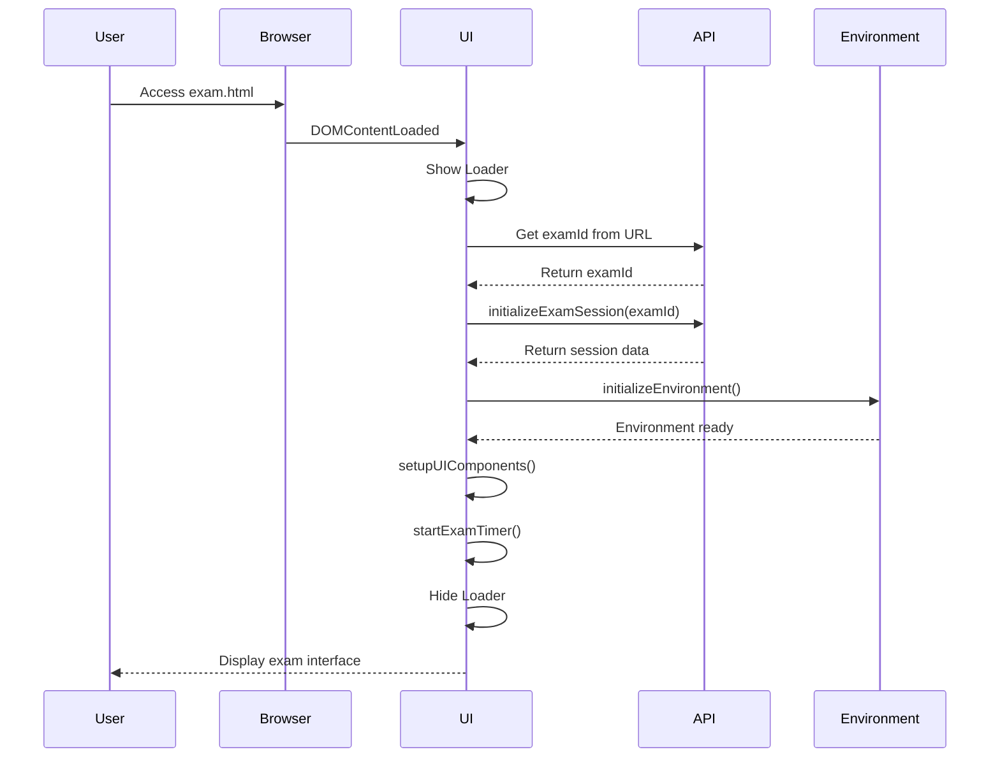
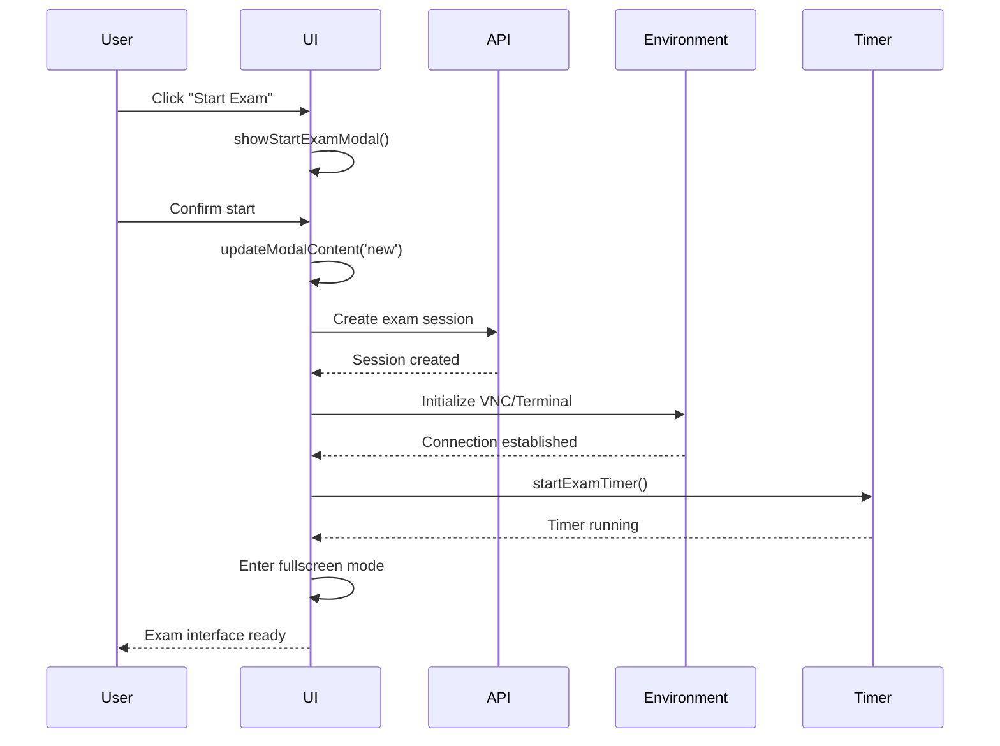
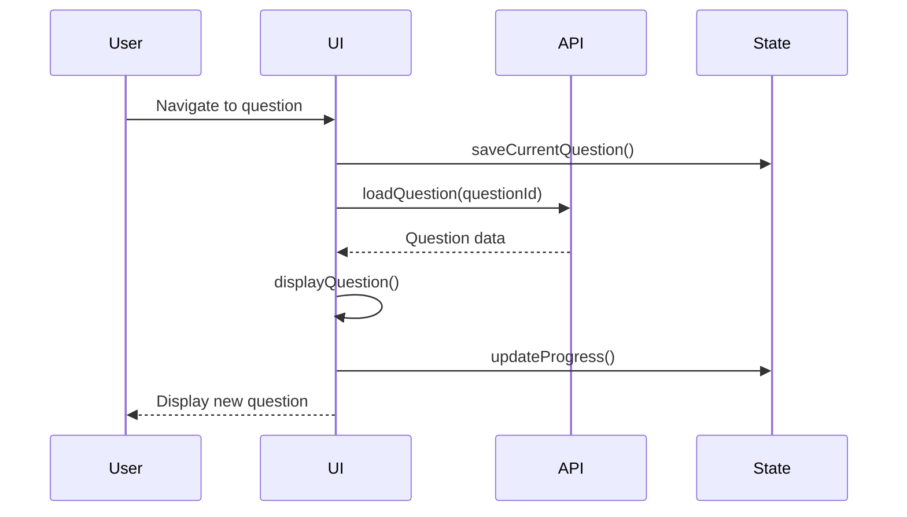
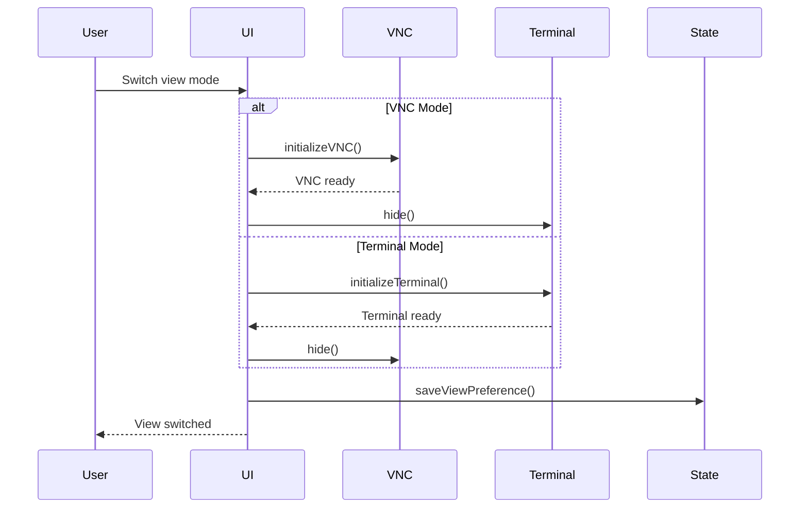
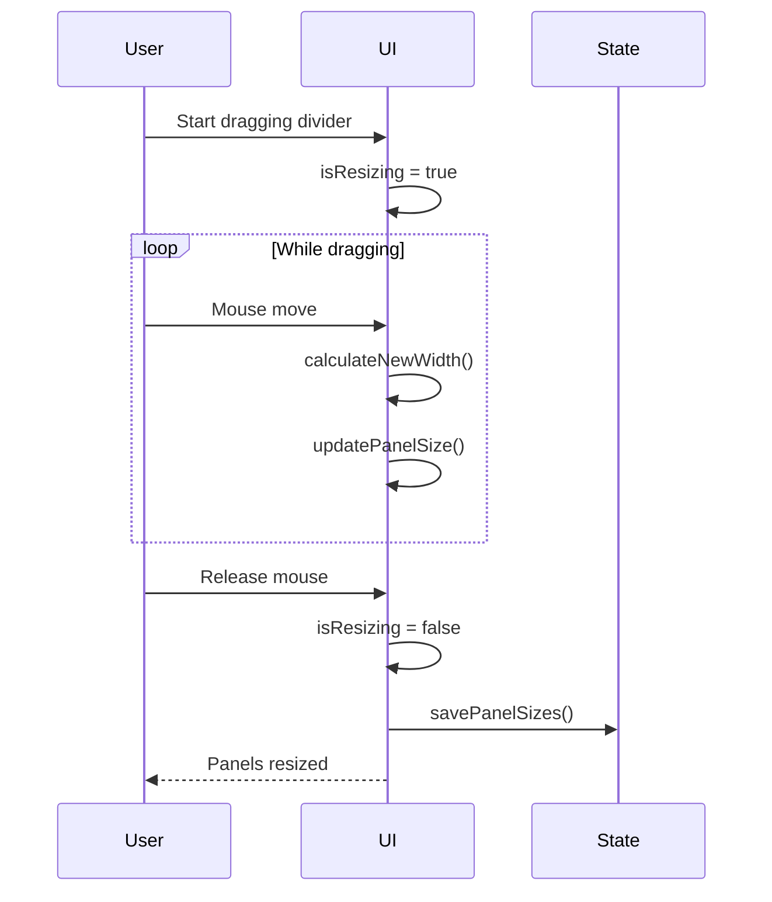
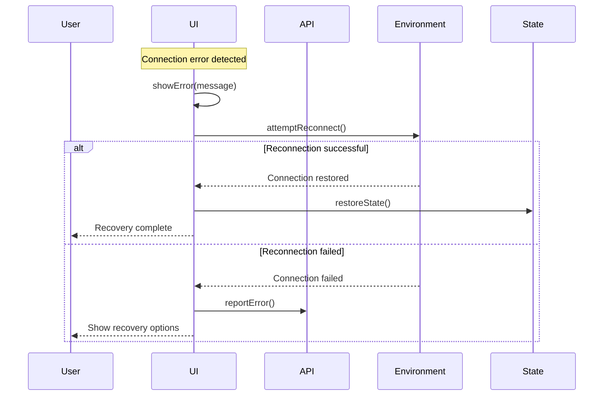
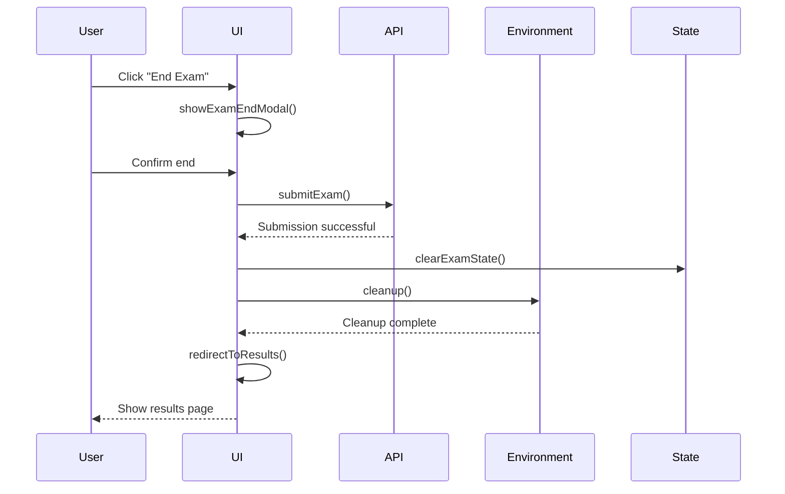
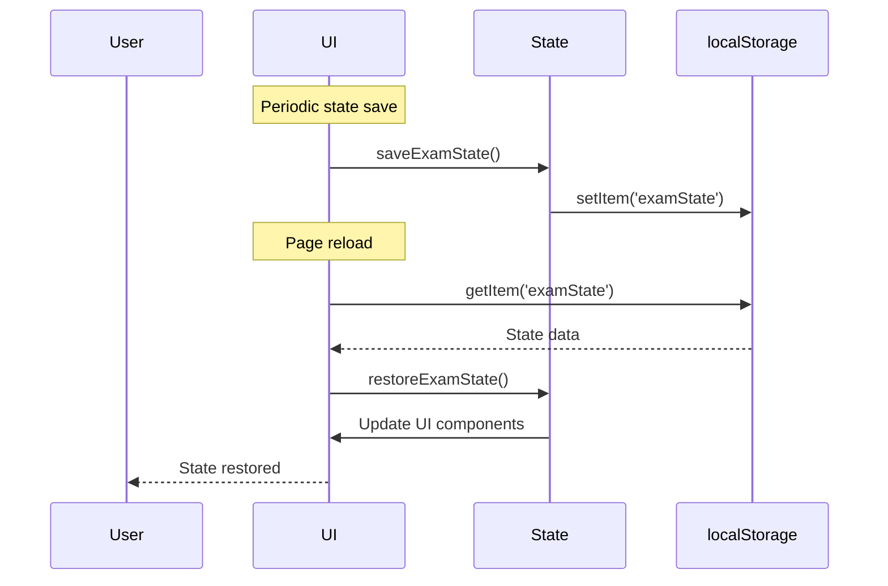
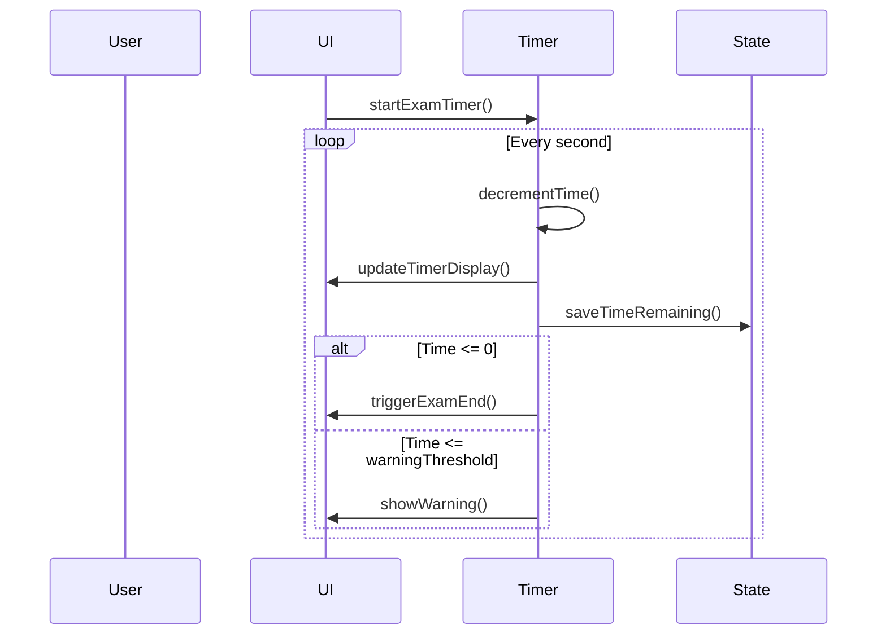
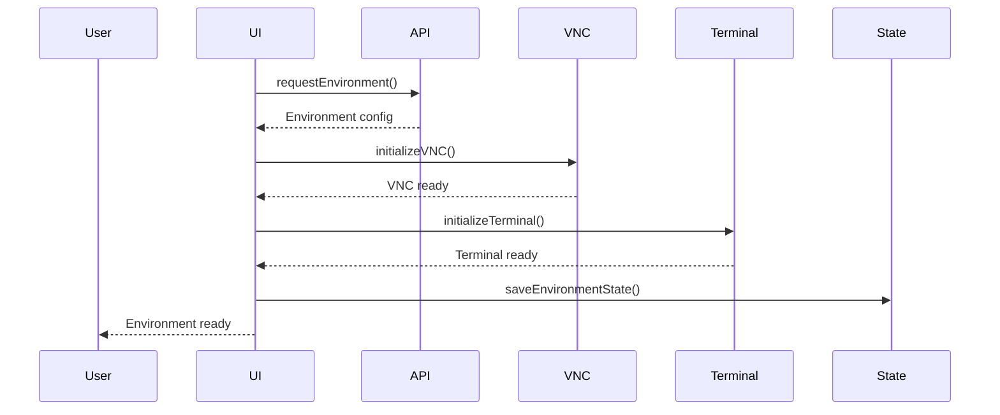

# CK-X Simulator: exam.html Functionality Documentation

This document provides a detailed technical overview of the `exam.html` file, focusing on its structure, interactions, and API calls.

## Table of Contents

1. [HTML Structure](#html-structure)
2. [Functionality Overview](#functionality-overview)
3. [Component Interactions](#component-interactions)
4. [API Integration](#api-integration)
5. [Event Handlers](#event-handlers)
6. [State Management](#state-management)
7. [Error Handling](#error-handling)

## HTML Structure

The `exam.html` file serves as the main exam interface for the CK-X Simulator. Here's a detailed breakdown of its structure:

### 1. Head Section
```html
<head>
    <meta charset="UTF-8">
    <meta name="viewport" content="width=device-width, initial-scale=1.0">
    <title>CK-X Simulator - Exam</title>
    <!-- External Dependencies -->
    <link href="https://fonts.googleapis.com/css2?family=JetBrains+Mono:wght@400;500;600&display=swap" rel="stylesheet">
    <link href="https://cdn.jsdelivr.net/npm/bootstrap@5.3.2/dist/css/bootstrap.min.css" rel="stylesheet">
    <link href="https://cdn.jsdelivr.net/npm/xterm@5.3.0/css/xterm.min.css" rel="stylesheet">
    <!-- Custom CSS -->
    <link rel="stylesheet" href="/css/exam.css">
</head>
```

### 2. Body Components

#### Loader Component
```html
<div class="loader" id="pageLoader">
    <div class="spinner-border text-light" role="status">
        <span class="visually-hidden">Loading...</span>
    </div>
</div>
```
- **Purpose**: Displays during initial page load and environment setup
- **State Management**: Controlled by `showLoader()` and `hideLoader()` functions

#### Toast Container
```html
<div class="toast-container position-fixed top-0 end-0 p-3" id="toastContainer">
    <!-- Toasts will be added here dynamically -->
</div>
```
- **Purpose**: Displays notifications and alerts
- **Dynamic Content**: Toasts added/removed based on events

#### Exam End Modal
```html
<div class="modal fade" id="examEndModal" data-bs-backdrop="static" data-bs-keyboard="false">
    <div class="modal-dialog modal-dialog-centered">
        <div class="modal-content">
            <!-- Modal content -->
        </div>
    </div>
</div>
```
- **Purpose**: Handles exam completion
- **Static Backdrop**: Prevents accidental dismissal
- **Results Button**: Triggers results page navigation

#### Start Exam Modal
```html
<div class="modal fade" id="startExamModal" data-bs-backdrop="static" data-bs-keyboard="false">
    <div class="modal-dialog modal-dialog-centered">
        <div class="modal-content">
            <!-- Different content states -->
            <div class="modal-body" id="newExamContent">
                <!-- New exam content -->
            </div>
            <div class="modal-body" id="examInProgressContent">
                <!-- In-progress exam content -->
            </div>
            <div class="modal-body" id="examCompletedContent">
                <!-- Completed exam content -->
            </div>
        </div>
    </div>
</div>
```
- **Multiple States**: Handles different exam scenarios
- **Static Backdrop**: Prevents accidental dismissal
- **Dynamic Content**: Updates based on exam state

#### Header Section
```html
<div class="header">
    <div class="header-title-section">
        <div class="header-title">CK-X Simulator</div>
        <div class="timer" id="examTimer">120:00</div>
    </div>
    <div class="header-controls">
        <!-- Dropdown menus -->
    </div>
</div>
```
- **Timer Display**: Shows remaining exam time
- **Control Menus**: Interface, controls, and information options

#### Main Container
```html
<div class="main-container" id="mainContainer">
    <!-- Question Panel -->
    <div class="question-panel" id="questionPanel">
        <!-- Question navigation and content -->
    </div>
    
    <!-- Resizable Divider -->
    <div class="panel-divider" id="panelDivider">
        <!-- Resize controls -->
    </div>
    
    <!-- VNC Panel -->
    <div class="vnc-panel" id="vncPanel">
        <!-- Terminal and VNC containers -->
    </div>
</div>
```
- **Split Layout**: Questions and environment panels
- **Resizable**: Adjustable panel sizes
- **Dual Interface**: VNC and terminal options

## Functionality Overview

The `exam.html` file provides the core exam interface for the CK-X Simulator. Here's a detailed breakdown of its functionality:

### 1. Exam Interface Components

#### Header Controls
1. **Exam Interface Dropdown**
   - Terminal resize options
   - Fullscreen toggle
   - View switching
   - Help resources

2. **Exam Controls Dropdown**
   - End exam option
   - Session termination
   - Emergency controls

3. **Exam Information Dropdown**
   - Exam instructions
   - Documentation links
   - Help resources

#### Main Interface
1. **Question Panel**
   - Question navigation
   - Question content display
   - Progress tracking
   - Answer submission

2. **Environment Panel**
   - VNC connection
   - Terminal access
   - View switching
   - Fullscreen options

### 2. Exam Flow Management

#### Initial Setup
1. **Session Validation**
   - Exam ID verification
   - Session state check
   - Environment preparation

2. **Interface Initialization**
   - Panel setup
   - Timer configuration
   - Connection establishment

3. **State Restoration**
   - Previous session recovery
   - Time remaining calculation
   - Question state restoration

#### During Exam
1. **Timer Management**
   - Countdown tracking
   - Time warnings
   - Auto-submission

2. **Question Navigation**
   - Next/Previous controls
   - Question selection
   - Progress tracking

3. **Environment Control**
   - View switching
   - Panel resizing
   - Fullscreen management

### 3. State Management

#### Exam State
- Timer tracking
- Question progress
- Answer submissions
- Environment state

#### UI State
- Panel sizes
- View selection
- Modal states
- Loading states

### 4. API Integration

#### Endpoints
1. **Exam Status**
   - `/facilitator/api/v1/exams/{id}`
   - Status updates
   - Time tracking

2. **Question Data**
   - `/facilitator/api/v1/exams/{id}/questions`
   - Question loading
   - Answer submission

3. **Environment Control**
   - `/facilitator/api/v1/exams/{id}/environment`
   - Connection management
   - State updates

### 5. Error Handling

#### Connection Issues
- VNC connection failures
- Terminal disconnections
- API communication errors

#### State Recovery
- Session restoration
- Timer synchronization
- Question state recovery

### 6. Security Features

#### Session Management
- Secure connections
- State validation
- Access control

#### Data Protection
- Secure communication
- State encryption
- Access restrictions

### 7. Performance Optimization

#### Resource Management
- Efficient rendering
- Connection pooling
- State caching

#### UI Responsiveness
- Smooth transitions
- Non-blocking operations
- Efficient updates

### 8. Browser Compatibility

#### Cross-browser Support
- Modern browser features
- Fallback mechanisms
- Consistent rendering

#### Mobile Support
- Responsive design
- Touch controls
- Adaptive layout

### 9. User Experience

#### Interface Feedback
- Loading states
- Progress indicators
- Status messages

#### Navigation
- Intuitive controls
- Clear indicators
- Easy access

### 10. Maintenance and Updates

#### Code Organization
- Modular structure
- Clear separation
- Maintainable components

#### Future Enhancements
- Feature addition points
- Integration capabilities
- Scalability options

## Component Interactions

### 1. Initial Page Load Sequence


### 2. Exam Start Flow


### 3. Question Navigation Flow


### 4. Environment Control Flow


### 5. Panel Resizing Flow


### 6. Error Recovery Flow


### 7. Exam End Flow


### 8. State Management Flow


### 9. Timer Management Flow


### 10. Environment Initialization Flow


## API Integration

### 1. Exam Session Management
```javascript
async function initializeExamSession(examId) {
    try {
        const response = await fetch(`/facilitator/api/v1/exams/${examId}`);
        if (!response.ok) throw new Error('Failed to load exam session');
        
        const data = await response.json();
        setupExamSession(data);
        
        return data;
    } catch (error) {
        console.error('Error initializing exam session:', error);
        showError('Failed to load exam session');
        return null;
    }
}
```

### 2. Question Management
```javascript
async function loadQuestion(questionId) {
    try {
        const response = await fetch(`/facilitator/api/v1/exams/${examId}/questions/${questionId}`);
        if (!response.ok) throw new Error('Failed to load question');
        
        const data = await response.json();
        displayQuestion(data);
        
        return data;
    } catch (error) {
        console.error('Error loading question:', error);
        showError('Failed to load question');
        return null;
    }
}
```

### 3. Environment Control
```javascript
async function initializeEnvironment() {
    try {
        const response = await fetch(`/facilitator/api/v1/exams/${examId}/environment`);
        if (!response.ok) throw new Error('Failed to initialize environment');
        
        const data = await response.json();
        setupEnvironment(data);
        
        return data;
    } catch (error) {
        console.error('Error initializing environment:', error);
        showError('Failed to initialize environment');
        return null;
    }
}
```

## Event Handlers

### 1. Modal Management
```javascript
// Show Exam End Modal
function showExamEndModal() {
    const modal = new bootstrap.Modal(document.getElementById('examEndModal'));
    modal.show();
}

// Show Start Exam Modal
function showStartExamModal() {
    const modal = new bootstrap.Modal(document.getElementById('startExamModal'));
    modal.show();
}

// Handle Modal State
function updateModalContent(state) {
    const newExamContent = document.getElementById('newExamContent');
    const inProgressContent = document.getElementById('examInProgressContent');
    const completedContent = document.getElementById('examCompletedContent');
    
    // Hide all content
    [newExamContent, inProgressContent, completedContent].forEach(el => {
        el.style.display = 'none';
    });
    
    // Show relevant content
    switch (state) {
        case 'new':
            newExamContent.style.display = 'block';
            break;
        case 'in_progress':
            inProgressContent.style.display = 'block';
            break;
        case 'completed':
            completedContent.style.display = 'block';
            break;
    }
}
```

### 2. View Management
```javascript
// Switch to Terminal View
function switchToTerminal() {
    document.getElementById('vncPanel').style.display = 'none';
    document.getElementById('sshTerminalContainer').style.display = 'block';
    initializeTerminal();
}

// Switch to VNC View
function switchToVNC() {
    document.getElementById('sshTerminalContainer').style.display = 'none';
    document.getElementById('vncPanel').style.display = 'block';
    initializeVNC();
}

// Toggle Fullscreen
function toggleFullscreen() {
    if (!document.fullscreenElement) {
        document.documentElement.requestFullscreen();
    } else {
        document.exitFullscreen();
    }
}
```

## State Management

### 1. Exam State
```javascript
// Save Exam State
function saveExamState() {
    const state = {
        currentQuestion: currentQuestionId,
        timeLeft: timeLeft,
        answers: submittedAnswers,
        environment: environmentState
    };
    
    localStorage.setItem('examState', JSON.stringify(state));
}

// Load Exam State
function loadExamState() {
    const state = localStorage.getItem('examState');
    if (state) {
        const parsedState = JSON.parse(state);
        restoreExamState(parsedState);
    }
}

// Clear Exam State
function clearExamState() {
    localStorage.removeItem('examState');
}
```

### 2. UI State
```javascript
// Update UI State
function updateUIState() {
    updateQuestionNavigation();
    updateTimerDisplay();
    updateEnvironmentStatus();
    updatePanelSizes();
}

// Save UI Preferences
function saveUIPreferences() {
    const preferences = {
        panelSizes: {
            question: document.getElementById('questionPanel').offsetWidth,
            environment: document.getElementById('vncPanel').offsetWidth
        },
        viewMode: currentViewMode,
        fullscreen: document.fullscreenElement !== null
    };
    
    localStorage.setItem('uiPreferences', JSON.stringify(preferences));
}

// Load UI Preferences
function loadUIPreferences() {
    const preferences = localStorage.getItem('uiPreferences');
    if (preferences) {
        const parsedPreferences = JSON.parse(preferences);
        applyUIPreferences(parsedPreferences);
    }
}
```

## Error Handling

### 1. Connection Error Handling
```javascript
// Handle VNC Connection Error
function handleVNCError(error) {
    console.error('VNC Connection Error:', error);
    showError('Failed to connect to exam environment');
    
    // Attempt recovery
    attemptVNCReconnect();
}

// Handle Terminal Connection Error
function handleTerminalError(error) {
    console.error('Terminal Connection Error:', error);
    showError('Failed to connect to terminal');
    
    // Attempt recovery
    attemptTerminalReconnect();
}

// Show Error Message
function showError(message) {
    const toast = document.createElement('div');
    toast.className = 'toast';
    toast.innerHTML = `
        <div class="toast-header">
            <strong class="me-auto">Error</strong>
            <button type="button" class="btn-close" data-bs-dismiss="toast"></button>
        </div>
        <div class="toast-body">${message}</div>
    `;
    
    document.getElementById('toastContainer').appendChild(toast);
    const bsToast = new bootstrap.Toast(toast);
    bsToast.show();
}
```

### 2. State Recovery
```javascript
// Attempt State Recovery
async function attemptStateRecovery() {
    try {
        // Check exam status
        const examStatus = await checkExamStatus();
        
        if (examStatus.isActive) {
            // Restore exam state
            await restoreExamState(examStatus);
            return true;
        }
        
        return false;
    } catch (error) {
        console.error('State Recovery Error:', error);
        return false;
    }
}

// Handle Session Timeout
function handleSessionTimeout() {
    showError('Session timeout. Attempting to reconnect...');
    attemptStateRecovery();
}
```

## Conclusion

The `exam.html` file provides a comprehensive exam interface for the CK-X Simulator, implementing robust features for exam delivery, environment management, and user interaction. The modular design ensures maintainability and extensibility while providing a secure and reliable exam experience.

Key aspects of the implementation include:
- Split-panel interface for questions and environment
- Real-time timer and progress tracking
- Dual interface support (VNC and Terminal)
- Comprehensive error handling and recovery
- Secure session management
- Responsive and adaptive design 