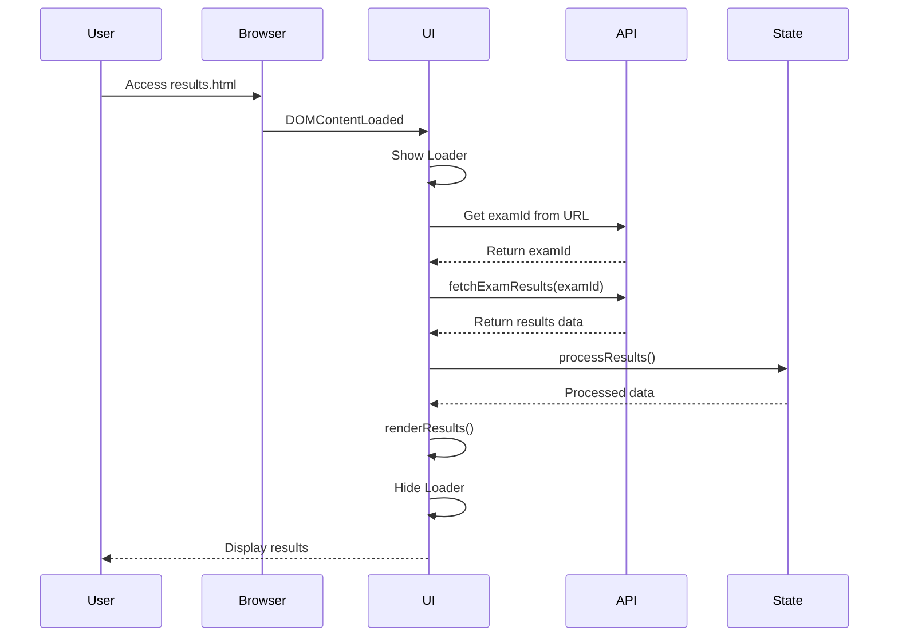
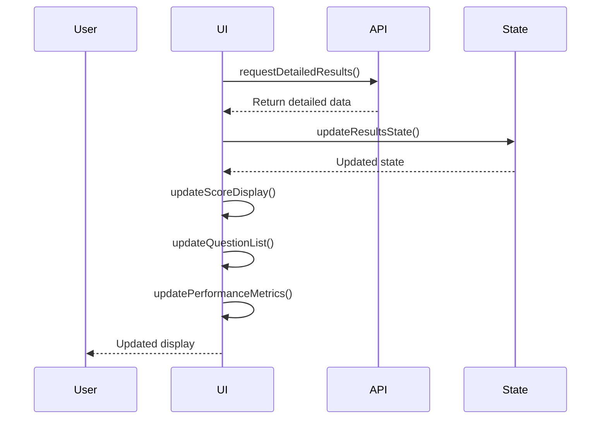
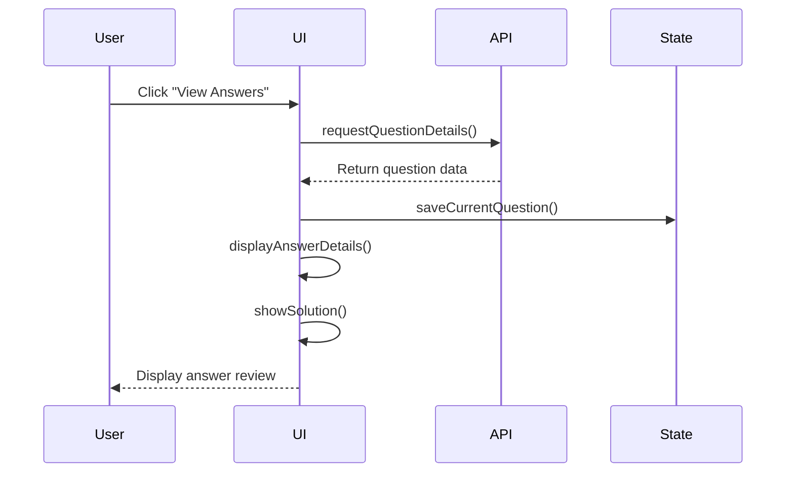
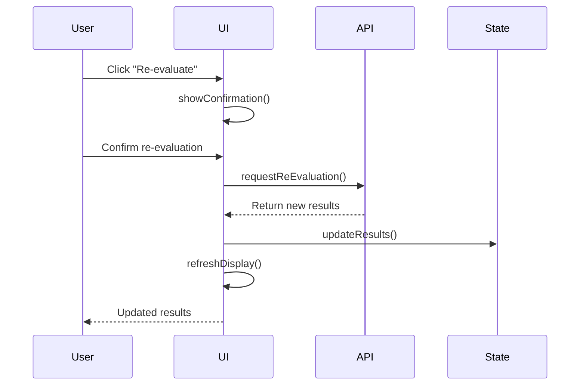
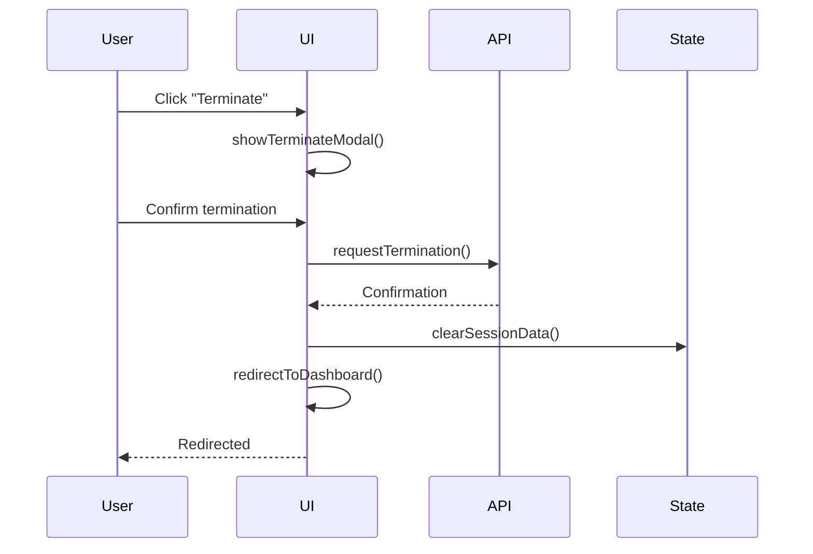
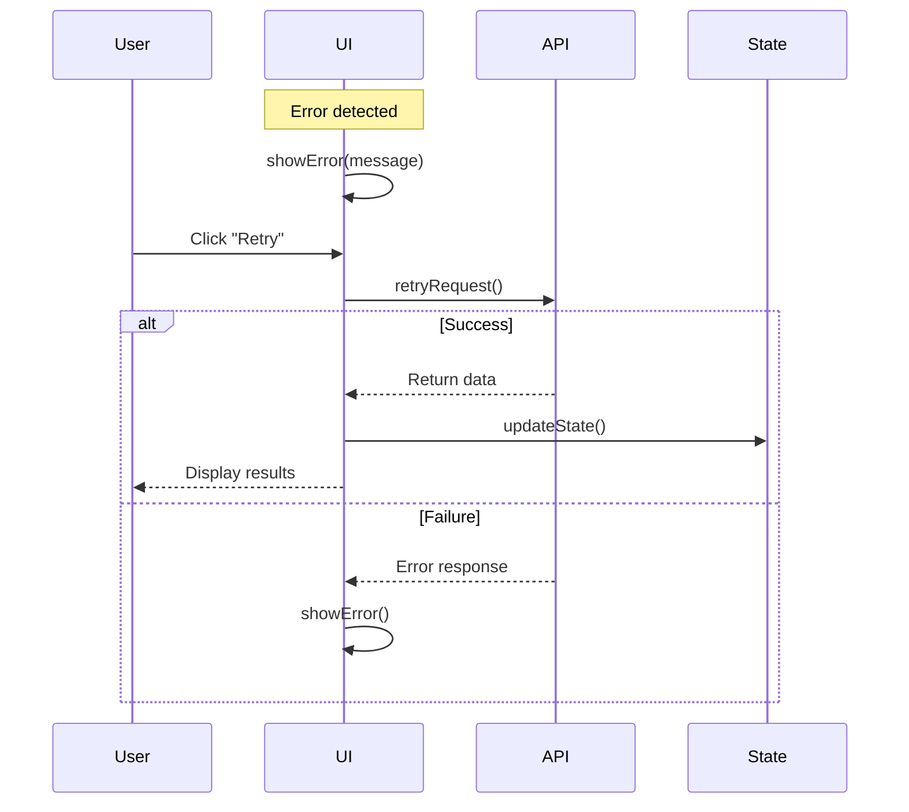
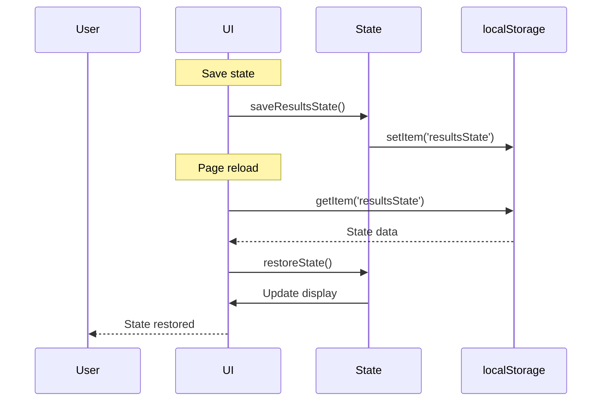

# CK-X Simulator: results.html Functionality Documentation

This document provides a detailed technical overview of the `results.html` file, focusing on its structure, interactions, and API calls.

## Table of Contents

1. [HTML Structure](#html-structure)
2. [Functionality Overview](#functionality-overview)
3. [Component Interactions](#component-interactions)
4. [API Integration](#api-integration)
5. [Event Handlers](#event-handlers)
6. [State Management](#state-management)
7. [Error Handling](#error-handling)

## HTML Structure

The `results.html` file serves as the results interface for the CK-X Simulator. Here's a detailed breakdown of its structure:

### 1. Head Section
```html
<head>
    <meta charset="UTF-8">
    <meta name="viewport" content="width=device-width, initial-scale=1.0">
    <title>Exam Results - CK-X Simulator</title>
    <!-- External Dependencies -->
    <link rel="stylesheet" href="/css/styles.css">
    <link rel="stylesheet" href="/css/results.css">
    <link rel="stylesheet" href="https://cdnjs.cloudflare.com/ajax/libs/font-awesome/6.0.0/css/all.min.css">
</head>
```

### 2. Body Components

#### Action Buttons
```html
<div class="results-actions">
    <button id="dashboardBtn" class="btn btn-secondary">
        <i class="fas fa-home me-2"></i>Dashboard
    </button>
    <button id="currentExamBtn" class="btn btn-info">
        <i class="fas fa-tasks me-2"></i>Current Exam
    </button>
    <button id="viewAnswersBtn" class="btn btn-success">
        <i class="fas fa-check-square me-2"></i>View Answers
    </button>
    <button id="reEvaluateBtn" class="btn btn-primary">
        <i class="fas fa-sync-alt me-2"></i>Re-evaluate Exam
    </button>
    <button id="terminateBtn" class="btn btn-danger">
        <i class="fas fa-power-off me-2"></i>Terminate Session
    </button>
</div>
```
- **Purpose**: Main navigation and action controls
- **Features**: Dashboard access, exam management, answer review, re-evaluation, session termination

#### Loading State
```html
<div id="pageLoader" class="page-loader">
    <div class="spinner"></div>
    <p id="loaderMessage">Loading exam results...</p>
</div>
```
- **Purpose**: Displays during results loading
- **State Management**: Controlled by `showLoader()` and `hideLoader()` functions

#### Error Message
```html
<div id="errorMessage" class="error-message" style="display: none;">
    <i class="fas fa-exclamation-circle"></i>
    <p id="errorText">An error occurred while loading the results.</p>
    <button id="retryButton" class="button">Retry</button>
</div>
```
- **Purpose**: Displays error states with retry option
- **Error Handling**: Controlled by `showError()` and `hideError()` functions

#### Results Content
```html
<div id="resultsContent" class="results-content" style="display: none;">
    <div class="results-header">
        <h2>Exam Results</h2>
        <div class="exam-info">
            <p id="examId">Exam ID: Loading...</p>
            <p id="completedAt">Completed: Loading...</p>
        </div>
    </div>
    <!-- Results content -->
</div>
```
- **Purpose**: Displays exam results and statistics
- **Dynamic Content**: Updated based on API responses

#### Terminate Modal
```html
<div id="terminateModal" class="modal-overlay" style="display: none;">
    <div class="modal-content">
        <!-- Modal content -->
    </div>
</div>
```
- **Purpose**: Confirms session termination
- **Safety Features**: Clear warning messages and confirmation required

## Functionality Overview

The `results.html` file provides a comprehensive results interface for the CK-X Simulator. Here's a detailed breakdown of its functionality:

### 1. Results Display Components

#### Score Summary
1. **Score Display**
   - Total score calculation
   - Maximum possible score
   - Percentage calculation
   - Visual score representation

2. **Rank Badge**
   - Performance level indicator
   - Visual status representation
   - Dynamic color coding

#### Question Breakdown
1. **Question List**
   - Individual question scores
   - Correct/incorrect indicators
   - Detailed feedback
   - Answer review options

2. **Performance Metrics**
   - Time taken per question
   - Difficulty level indicators
   - Success rate analysis

### 2. Action Management

#### Navigation Controls
1. **Dashboard Access**
   - Return to main dashboard
   - Session history access
   - Performance overview

2. **Exam Management**
   - Current exam access
   - Session continuation
   - Environment restoration

#### Review Options
1. **Answer Review**
   - Detailed answer display
   - Correct solution comparison
   - Learning resources

2. **Re-evaluation**
   - Score recalculation
   - Performance reassessment
   - Result updates

### 3. State Management

#### Results State
- Score tracking
- Question status
- Performance metrics
- Session information

#### UI State
- Loading states
- Error states
- Modal visibility
- Content display

### 4. API Integration

#### Endpoints
1. **Results Data**
   - `/facilitator/api/v1/exams/{id}/results`
   - Score retrieval
   - Performance data

2. **Question Details**
   - `/facilitator/api/v1/exams/{id}/questions`
   - Answer review
   - Solution access

3. **Session Management**
   - `/facilitator/api/v1/exams/{id}/session`
   - Status updates
   - Environment control

## Component Interactions

### 1. Initial Results Load Sequence


### 2. Results Display Flow


### 3. Answer Review Flow


### 4. Re-evaluation Flow


### 5. Session Termination Flow


### 6. Error Recovery Flow


### 7. State Management Flow


## API Integration

### 1. Results Fetching
```javascript
async function fetchExamResults(examId) {
    try {
        const response = await fetch(`/facilitator/api/v1/exams/${examId}/results`);
        if (!response.ok) throw new Error('Failed to fetch results');
        
        const data = await response.json();
        processResults(data);
        
        return data;
    } catch (error) {
        console.error('Error fetching results:', error);
        showError('Failed to load exam results');
        return null;
    }
}
```

### 2. Question Details
```javascript
async function fetchQuestionDetails(questionId) {
    try {
        const response = await fetch(`/facilitator/api/v1/exams/${examId}/questions/${questionId}`);
        if (!response.ok) throw new Error('Failed to fetch question details');
        
        const data = await response.json();
        displayQuestionDetails(data);
        
        return data;
    } catch (error) {
        console.error('Error fetching question details:', error);
        showError('Failed to load question details');
        return null;
    }
}
```

### 3. Session Management
```javascript
async function terminateSession() {
    try {
        const response = await fetch(`/facilitator/api/v1/exams/${examId}/terminate`, {
            method: 'POST'
        });
        
        if (!response.ok) throw new Error('Failed to terminate session');
        
        clearSessionData();
        redirectToDashboard();
        
        return true;
    } catch (error) {
        console.error('Error terminating session:', error);
        showError('Failed to terminate session');
        return false;
    }
}
```

## Event Handlers

### 1. Button Actions
```javascript
// Dashboard Navigation
document.getElementById('dashboardBtn').addEventListener('click', () => {
    window.location.href = '/dashboard';
});

// Current Exam Access
document.getElementById('currentExamBtn').addEventListener('click', () => {
    window.location.href = `/exam?id=${examId}`;
});

// Answer Review
document.getElementById('viewAnswersBtn').addEventListener('click', async () => {
    await loadQuestionDetails();
    showAnswerReview();
});

// Re-evaluation
document.getElementById('reEvaluateBtn').addEventListener('click', async () => {
    if (confirm('Are you sure you want to re-evaluate the exam?')) {
        await reEvaluateExam();
    }
});

// Session Termination
document.getElementById('terminateBtn').addEventListener('click', () => {
    showTerminateModal();
});
```

### 2. Modal Management
```javascript
// Show Terminate Modal
function showTerminateModal() {
    document.getElementById('terminateModal').style.display = 'block';
}

// Hide Terminate Modal
function hideTerminateModal() {
    document.getElementById('terminateModal').style.display = 'none';
}

// Handle Modal Actions
document.getElementById('confirmTerminateBtn').addEventListener('click', async () => {
    await terminateSession();
    hideTerminateModal();
});

document.getElementById('cancelTerminateBtn').addEventListener('click', () => {
    hideTerminateModal();
});
```

## State Management

### 1. Results State
```javascript
// Save Results State
function saveResultsState() {
    const state = {
        examId: currentExamId,
        results: currentResults,
        timestamp: Date.now()
    };
    
    localStorage.setItem('resultsState', JSON.stringify(state));
}

// Load Results State
function loadResultsState() {
    const state = localStorage.getItem('resultsState');
    if (state) {
        const parsedState = JSON.parse(state);
        restoreResultsState(parsedState);
    }
}

// Clear Results State
function clearResultsState() {
    localStorage.removeItem('resultsState');
}
```

### 2. UI State
```javascript
// Update UI State
function updateUIState() {
    updateScoreDisplay();
    updateQuestionList();
    updatePerformanceMetrics();
    updateActionButtons();
}

// Save UI Preferences
function saveUIPreferences() {
    const preferences = {
        showDetails: showDetailedResults,
        sortOrder: currentSortOrder,
        filterSettings: currentFilters
    };
    
    localStorage.setItem('uiPreferences', JSON.stringify(preferences));
}

// Load UI Preferences
function loadUIPreferences() {
    const preferences = localStorage.getItem('uiPreferences');
    if (preferences) {
        const parsedPreferences = JSON.parse(preferences);
        applyUIPreferences(parsedPreferences);
    }
}
```

## Error Handling

### 1. Error Display
```javascript
// Show Error Message
function showError(message) {
    const errorElement = document.getElementById('errorMessage');
    const errorText = document.getElementById('errorText');
    
    errorText.textContent = message;
    errorElement.style.display = 'block';
    
    // Auto-hide after 5 seconds
    setTimeout(() => {
        hideError();
    }, 5000);
}

// Hide Error Message
function hideError() {
    document.getElementById('errorMessage').style.display = 'none';
}

// Handle Retry
document.getElementById('retryButton').addEventListener('click', async () => {
    hideError();
    await loadResults();
});
```

### 2. State Recovery
```javascript
// Attempt State Recovery
async function attemptStateRecovery() {
    try {
        const state = loadResultsState();
        if (state && state.examId) {
            await restoreResultsState(state);
            return true;
        }
        return false;
    } catch (error) {
        console.error('State Recovery Error:', error);
        return false;
    }
}

// Handle Session Timeout
function handleSessionTimeout() {
    showError('Session timeout. Attempting to recover...');
    attemptStateRecovery();
}
```

## Conclusion

The `results.html` file provides a comprehensive results interface for the CK-X Simulator, implementing robust features for displaying exam results, managing sessions, and facilitating review and re-evaluation. The modular design ensures maintainability and extensibility while providing a clear and informative results experience.

Key aspects of the implementation include:
- Detailed score and performance display
- Comprehensive question breakdown
- Flexible review options
- Robust error handling
- Secure session management
- Responsive and intuitive interface 